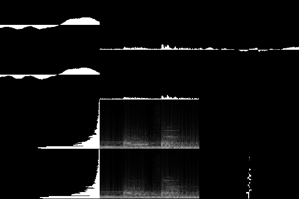

# Pipe Sound Visualizer



## これは何？

これはパイプ（標準入力）で渡された生の音声データを視覚的な情報（波形やスペクトログラム）として表示するプログラムです。入力されたデータは標準出力されるので、音声を同時に再生することもできます。

## 使用例

マイク等から入力された音声を表示するコマンドは以下の通りです。標準出力を使用しない場合は`/dev/null`で結果を破棄してください。

```sh:Bash
arecord -t raw -f dat | \
java -jar PipeSoundVisualizer.jar 1> /dev/null
```

PulseAudioを使用している場合は`ffmpeg`コマンドを用いてコンピューターが出力する音声を表示することもできます。

```sh:Bash
ffmpeg -loglevel error \
    -f pulse -i default -acodec copy \
    -ar 48000 -ac 2 -f wav - | \
java -jar PipeSoundVisualizer.jar 1> /dev/null
```

音声ファイルを適切な速度（リアルタイム）で表示・再生する場合はプログラムへデータを渡す際に入力速度を制限する必要があります。

```sh:Bash
ffmpeg -loglevel error -i <your_file> \
    -af asetpts=PTS,arealtime,asetpts=PTS \
    -ar 48000 -ac 2 -f wav - | \
java -jar PipeSoundVisualizer.jar | \
aplay -t raw -f dat
```

## オプション

`-r` `<freq_rate: int = 48000>`  
サンプリング周波数を指定します。

`-b` `<bit_rate: int = 16>`  
ビット深度を指定します。

`-c` `<channels: int = 2>`  
チャンネル数を指定します。

`-l` `<buffered_sample_length: int = 800>`  
一度にバッファリングするサンプル数（データ量÷チャンク長÷チャンネル数）を指定します。この値が小さいほどグラフィックの更新頻度と処理負荷が高くなります。サンプリング周波数÷フレームレートで適切な値を計算できます。

`-s` `<sample_length: int = 1024>`  
周波数解析（高速フーリエ変換: FFT）で使用するサンプル数を指定します。2の冪乗の値が推奨されます。

`--single`  
一つのウィンドウに全ての情報が表示されます（単一ウィンドウ）。指定がない場合は各要素が独立したウィンドウに表示されます（独立ウィンドウ）。

`-fw` `<width: int = 400>`  
ウィンドウの横幅を指定します。独立ウィンドウの場合は全てのウィンドウに同じ値が割り当てられます。

`-fh` `<height: int = 400>`  
ウィンドウの縦幅を指定します。独立ウィンドウの場合は全てのウィンドウに同じ値が割り当てられます。

`-fx` `<pos_x: int = 10>`  
ウィンドウのX座標を指定します。独立ウィンドウの場合は左上に配置されるウィンドウの基準になります。

`-fy` `<pos_y: int = 10>`  
ウィンドウのY座標を指定します。独立ウィンドウの場合は左上に配置されるウィンドウの基準になります。

`-v` or `--version`  
プログラムのバージョンを表示します。

`-h` or `--help`  
プログラムの使い方を表示します。
